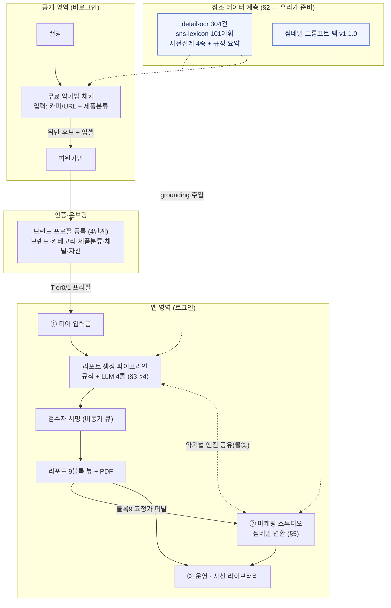
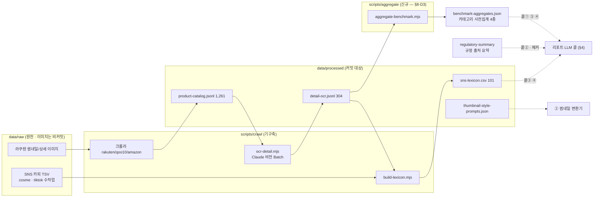
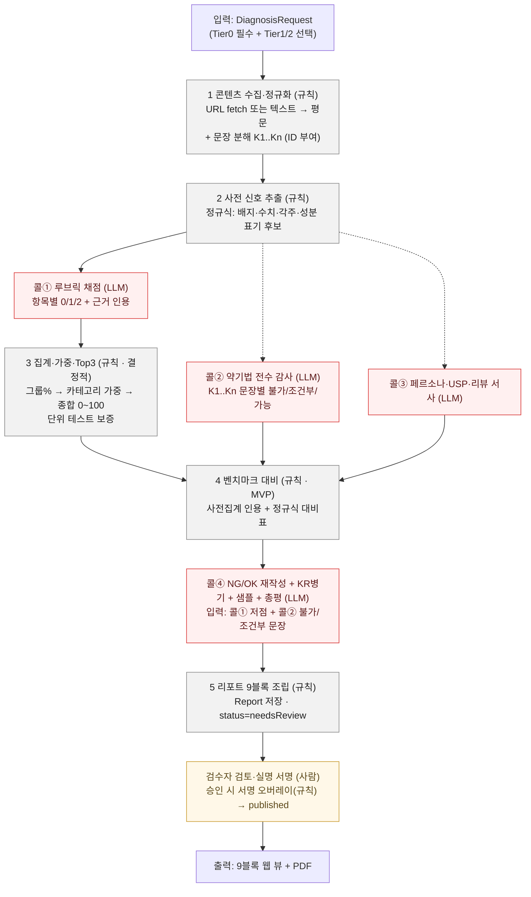
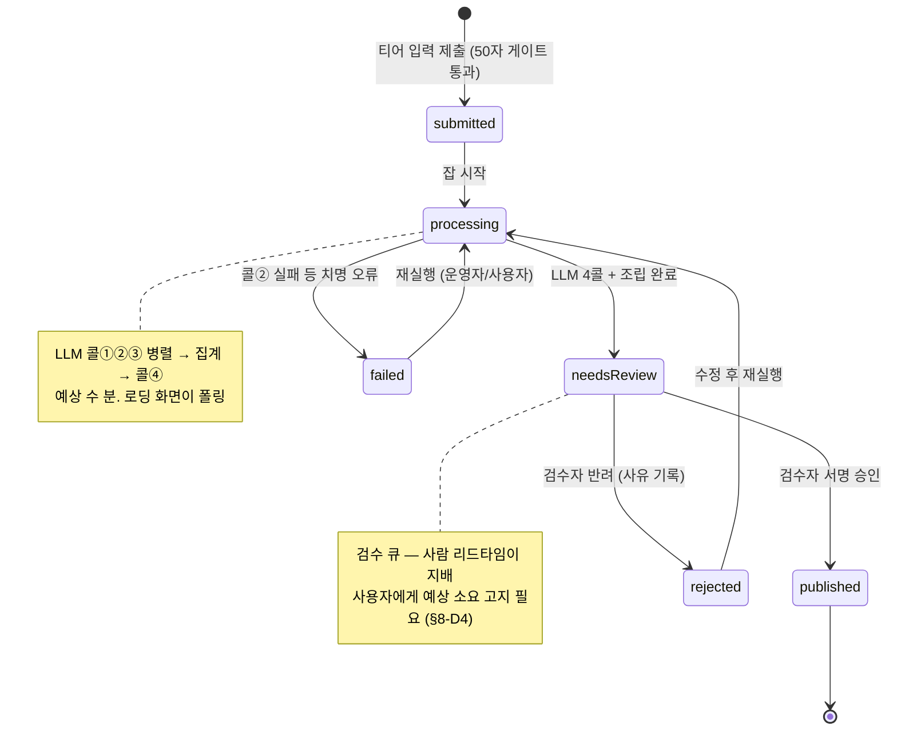
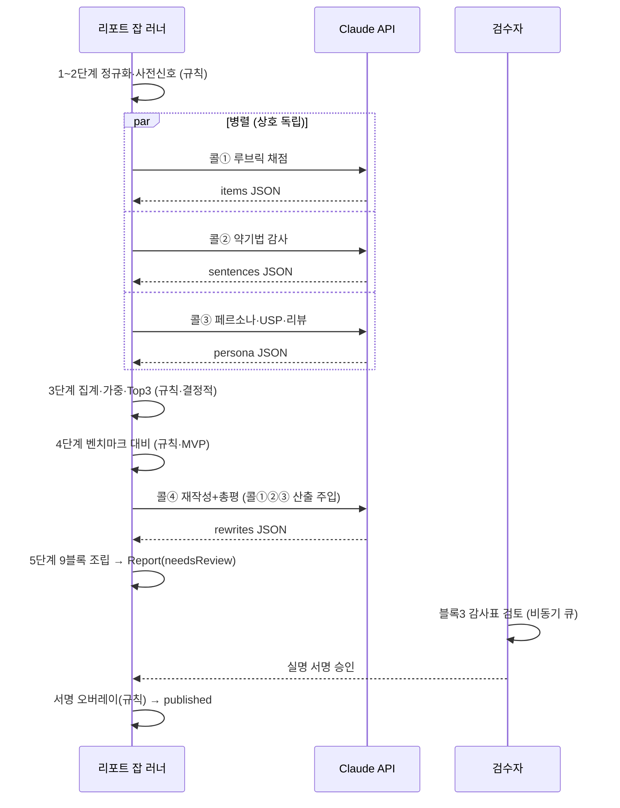
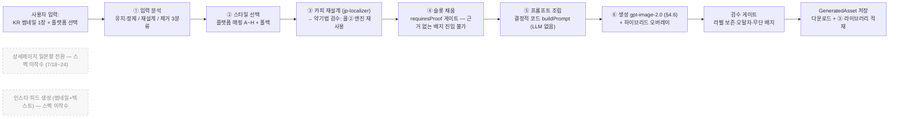
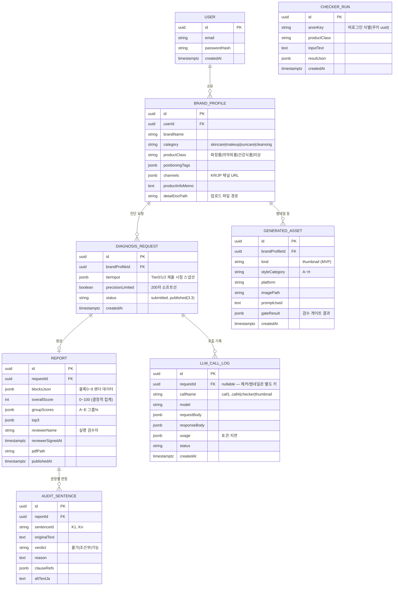

# 08 · 데이터 플로우 (사용자 입력 → 가공 → 결과물)

> 3축 서비스에서 **사용자가 무엇을 입력하고, 시스템이 어떻게 가공해, 어떤 형태로 결과물을 제공하는가**를 한 장으로 잇는 개발 착수용 기준 문서.
> 작성: 2026-07-09 · 상태: **개발 착수용 (7/11 ① 리포트 스프린트 기준)**
> 관련: [[specs/01-report-spec]](스펙 정본 — 티어 입력·9블록·집계 공식) · [[specs/02-thumbnail-converter-spec]] · [[07-ia]](화면 위계) · [[research/jp-detail-message-patterns]](루브릭 정본) · [[09-dev-spec]](구현 순서·모듈 구조) · [../design/wireframes/public-onboarding-spec.md](../design/wireframes/public-onboarding-spec.md) · [../data/README.md](../data/README.md)
>
> **문서 역할 분담:** 필드 검증 규칙·집계 공식·블록별 산출 근거는 `01-report-spec.md`가 정본이다. 이 문서는 그것들을 **흐름(무엇이 어디로 흘러 무엇이 되는가)과 계약(LLM 요청/응답 스키마·저장 엔티티)** 관점으로 잇는다. 두 문서가 충돌하면 스펙을 고치든 이 문서를 고치든 **한쪽으로 정합화**한다.
>
> 미결 사항은 §8에 **기본안 + 근거 + 대안**으로 정리했다 — 팀이 채택/수정만 하면 된다. 채택 시 `decisions/DECISIONS.md`로 승격.

---

## 1. 서비스 전체 데이터 플로우 조감 (Level 0)

### 1.1 액터

| 액터 | 입력하는 것 | 받는 것 |
|---|---|---|
| **비로그인 방문자** | 카피 텍스트/URL + 제품분류 (무료 체커) | 위반 표현 후보 + 조항 근거 + 리포트 업셀 |
| **로그인 브랜드** | 브랜드 프로필(온보딩) · 티어 입력(리포트) · 이미지+플랫폼(썸네일) | 리포트 9블록·PDF · 일본향 썸네일 · 자산 라이브러리 |
| **내부 검수자** | 감사표 검토 결과 + 실명 서명 | 검수 큐(발행 대기 리포트) |
| **시스템(배치)** | 코퍼스 원천(`data/raw`) | 사전집계·렉시콘 등 grounding 자산(§2) |

### 1.2 전체 흐름 한 장

핵심 구조: **브랜드 프로필이 공통 허브**, ① 리포트가 전환 허브, **약기법 판정 엔진(콜②)을 ①과 ②가 공유**, 참조 데이터 계층(§2)이 모든 LLM 콜에 grounding으로 주입된다.



- 근거: [[07-ia]] §4(사이트맵)·§7(공통 엔티티)·§8(유저 플로우)를 데이터 관점으로 재구성.
- 무료→로그인 경계: 체커는 비로그인 3회(§6 `CheckerRun`), 리포트 발행 시점에 가입·온보딩 유도.

---

## 2. 참조 데이터 계층 (사용자 입력이 아닌, 우리가 준비하는 데이터)

사용자 입력만으로는 "일본 고객 관점 재설계"가 성립하지 않는다. 아래 자산이 **모든 판단 콜의 근거(grounding)** 로 주입되며, 리포트가 인용하는 "증거"의 원천이다(증거 원칙).

| 자산 | 내용 | 소비처 |
|---|---|---|
| `data/processed/detail-ocr.jsonl` | 라쿠텐 상세 OCR 304건 (`rawText`·`appeals`·`ingredients`·`trustBadges`) | 블록4 벤치마크 실측 인용 · 블록5 코퍼스 근거 · 사전집계의 원천 |
| `data/processed/sns-lexicon.csv` | 일본 뷰티 어휘 101건 + 빈도 | 콜③·④ 어휘 grounding · 블록4-3 검색표기 전환 |
| `data/processed/product-catalog.jsonl` | 제품 이미지 메타 1,261건 | OCR 파이프라인의 부모 카탈로그 (직접 주입 안 함) |
| `data/processed/thumbnail-style-labels.jsonl` / `thumbnail-style-prompts.json` | 스타일 라벨 120건 · 프롬프트 팩 v1.1.0 | ② 썸네일 변환기(§5)가 직접 로드 |
| **(신규 필요) `benchmark-aggregates.json`** | 카테고리별 사전집계 4종(상위 배지·성분·문법·리뷰 패턴 일반형) | 콜①·③·④ grounding — **원본 코퍼스를 통째로 넣지 않는다**(스펙 §5.2) |
| **(신규 필요) `regulatory-summary.md`(가칭)** | 약기법 조항 프레임 요약(56항목·適正広告GL·景表法) + 각주 번호 체계 | 콜②·체커 grounding · 블록9 출처 |

> ⚠️ **`detail-ocr.jsonl`이 현재 워킹 트리에서 삭제된 상태**(git status `D`, HEAD에는 보존). 리포트 스펙·샘플이 라인번호까지 인용하는 핵심 근거 파일이므로, 의도된 삭제가 아니면 `git restore data/processed/detail-ocr.jsonl`로 복구해야 한다.

### 2.1 데이터 리니지 (원천 → 정제 → 주입)



**사전집계 기본안(스펙 §9-Q9의 답):** `scripts/aggregate/aggregate-benchmark.mjs`(신규)가 `detail-ocr.jsonl`을 카테고리별로 집계해 `data/processed/benchmark-aggregates.json`을 **빌드 타임 산출물**로 커밋한다. 갱신 주기 = 코퍼스 갱신 시 수동 재실행(MVP). OCR 노이즈 필터는 1차로 "빈도 2회 미만 배지·성분 제외 + 육안 스팟체크" 수준으로 시작(§8-D3).

---

## 3. ① 진단 리포트 상세 플로우

### 3.1 입력 — 티어 스키마와 온보딩 프리필

입력 필드·검증 규칙·폴백의 정본은 스펙 §3. 여기서는 **어디서 온 값이 어느 필드로 흘러드는지**를 확정한다.

| 리포트 입력 필드 | 티어 | 출처 (프리필) | 비고 |
|---|---|---|---|
| `category` | Tier 0 | 온보딩 ①단계 "카테고리"(정본 4종 enum) → **프리필** | 엔진 키. 폼에서 수정 가능, "브랜드 프로필에서 이어받음" 표기 |
| `productClass` | Tier 0 | 온보딩 "제품 분류"(4종) → **프리필** | 온보딩 `건강식품` 선택 시 → 리포트 엔진 미지원 분기(§8-D9) |
| `source` (url\|text) | Tier 0 | 온보딩 ②단계 "한국 채널·판매페이지 URL"을 **후보로 제시**(자동 채움 아님 — 진단 대상 확정은 사용자) | 50자 하드게이트 / 200자 소프트선은 이 필드에서 발동 |
| `brandName` | Tier 1 | 온보딩 브랜드명 → **프리필** | |
| `productName` | Tier 1 | 직접 입력 | 온보딩엔 없음 |
| `keyIngredients` (≤8) | Tier 1 | 직접 입력 | |
| `priceJPY` | Tier 1 | 온보딩 ③단계 "제품 관리 정보"에 가격(JPY) 있으면 **후보 제시** | 자유 텍스트라 파싱 신뢰 낮음 → 후보 제시만 |
| `targetMemo` | Tier 1 | 직접 입력 | |
| `reviewSourceUrl` | Tier 2 | 직접 입력 | MVP는 수집만, 실측 분석 v2(스펙 §3.3) |
| (참고) 포지셔닝 태그 | — | 온보딩 → 콜③ **보조 컨텍스트**로만 주입 | 엔진 키 아님(카테고리와 직교, [[07-ia]] 택소노미) |

**검증 게이트 위치:** 50자 미만 = 클라이언트에서 생성 버튼 잠금(제출 자체 불가). 50~199자 = 제출 허용 + `DiagnosisRequest.precisionLimited = true` 저장 → 리포트 전 블록에 "정밀도 제한" 배지 렌더. `url` fetch 실패 = 에러 메시지에서 텍스트 붙여넣기 1급 경로 안내(스펙 AC-1.3).

### 3.2 가공 — 파이프라인 (규칙 vs LLM)

스펙 §5.1의 10단계를 데이터 관점으로 펼친다. **규칙(결정적) 단계는 회색, LLM 판단 단계는 적색.** 각 LLM 노드의 요청/응답 계약은 §4.



단계별 입·출력 계약:

| 단계 | 입력 데이터 | 출력 데이터 | 방식 | 참조 데이터 | 실패 시 폴백 |
|---|---|---|---|---|---|
| 1 정규화 | `source`(url/text) | 정규화 평문 + **문장 목록 K1..Kn**(ID는 코드가 부여 — LLM에 문장 분해를 맡기지 않음) | 규칙 | — | url fetch 실패 → 텍스트 붙여넣기 안내(재입력) |
| 2 사전 신호 | 평문 | 배지/수치/각주/성분 표기 후보(정규식) | 규칙 | 렉시콘 상위 어휘 | 신호 0건이어도 진행(콜①이 전량 판단) |
| 콜① 채점 | 평문+사전신호+`category`/`productClass`+**적용 항목 목록**(E군은 코드가 카테고리로 선별) | 항목별 `{itemId, score, evidenceQuote, criterionRef, corpusRef}` | LLM | 루브릭 §4 전문 + 사전집계 | §4.0 공통 폴백 → 블록5 "정밀도 제한" |
| 3 집계 | 콜① 점수 | 그룹%·종합 0~100·저점 Top3 | 규칙(결정적) | 카테고리 가중치 표(스펙 블록5) | — (순수 함수, 단위 테스트) |
| 콜② 감사 | K1..Kn + `productClass` | 문장별 판정+조항각주+합법 대체표현 | LLM | 규정 출처 요약 | 폴백 → 블록3 생략 불가이므로 **재시도 후에도 실패 시 잡 실패 처리**(감사 없는 리포트 발행 금지, 스펙 성공지표) |
| 콜③ 페르소나 | 콘텐츠 요약+`category`/`priceJPY`/`targetMemo`+포지셔닝 태그 | 페르소나·여정·반대이유·USP표·리뷰 서사 | LLM | 사전집계(카테고리 관례·리뷰 일반형) | 폴백 → 블록2·6 카테고리 일반형 템플릿 |
| 4 벤치마크 | 사전집계 + 고객 문장 | 인용·대비표·검색표기 전환 데이터 | 규칙(MVP) | `benchmark-aggregates.json`+렉시콘 | 사전집계 결손 카테고리 → 블록4 축소 렌더 |
| 콜④ 재작성 | 저점 항목(3단계)+불가/조건부 문장(콜②)+원문 | 총평+NG/OK 3~5쌍(JP+KR역문)+샘플 1종 | LLM | 코퍼스 실측 표현+렉시콘 | 폴백 → 블록7·8 축소 + "정밀도 제한" |
| 5 조립 | 전 단계 산출물 | `Report`(블록0~9 JSON) 저장 | 규칙 | 고정가 퍼널표 상수 | — |
| 검수 | 블록3 감사표 | 서명(검수자명+일시) → 발행 | 사람+규칙 | — | 반려 시 status=rejected + 사유 → 재실행 or 수동 수정 |

**콜 간 의존과 병렬성:** 콜①·②·③은 서로 독립(모두 1·2단계 산출물만 소비) → **병렬 실행**. 콜④만 콜①(저점)·콜②(위반 문장)에 의존 → 집계 후 실행. §4.7 시퀀스 다이어그램 참조.

### 3.3 상태 머신 — 발행은 "비동기 잡 + 검수 큐"

검수자 서명이 발행 필수 조건(서명 없는 발행 0건 — 스펙 성공지표)이므로, 리포트 생성은 **제출 즉시 완료되는 동기 요청이 아니라 상태를 갖는 비동기 잡**이다. 화면(처리 로딩)은 이 상태를 폴링한다.



- `precisionLimited`(200자 소프트선)·`isDemoSample`(블록8 데모 라벨)은 상태가 아니라 **플래그** — `Report`에 저장돼 렌더에만 영향.
- `needsReview` 리드타임은 30만 고정가 상품의 체감 품질을 좌우 → 검수자용 내부 화면(§7 공백)과 함께 §8-D4에서 결정.

### 3.4 출력

| 산출물 | 형태 | 생성 방식 |
|---|---|---|
| **리포트 9블록 웹 뷰** | 앱 내 1페이지 스크롤(블록0~9, [[07-ia]] §6 화면 인벤토리) | `Report.blocksJson`을 블록 컴포넌트로 렌더 |
| **PDF** | 품의용(블록0 표지 포함) | 웹 뷰와 동일 데이터의 서버 렌더(구현 방식은 스프린트 중 확정) |
| 웹 공유링크 | — | **v2 보류**(스펙 §9-Q7) |

**결제 게이트 자리(기본안):** `needsReview → published` 직전 — 즉 "리포트 완성 확인 후 결제 → 발행". MVP는 실결제 없이 수동 처리하되 화면 자리만 확보(§8-D2).

---

## 4. LLM 호출 명세 — 콜 단위 요청/응답 계약

리포트 4콜(①~④) + 무료 체커 1콜 + ② 썸네일 생성 1콜. 스펙 §5.2의 "스키마 고정 JSON"을 실제 요청 형태까지 구체화한다.

### 4.0 공통 규약 (전 Claude 콜)

| 항목 | 기본안 | 근거 |
|---|---|---|
| SDK | `@anthropic-ai/sdk` (TypeScript) | 저장소 선례: `scripts/crawl/ocr-detail.mjs` |
| 모델 | `claude-sonnet-5` | OCR 파이프라인과 동일(일본어 정확도·비용 균형 검증됨). 인트로 요금 $2/$10 per MTok(~2026-08-31) |
| 모델 대안 | 콜④(재작성 품질 민감) → `claude-opus-4-8` 상향 / 체커(비로그인·대량) → `claude-haiku-4-5` 하향 | UT 결과·비용 실측으로 콜별 확정 |
| 구조화 출력 | `output_config: { format: { type: "json_schema", schema } }` — 전 콜 적용. 스키마는 `additionalProperties: false` + `required` 전 필드 | 파싱 안정성. OCR 스크립트와 동일 패턴 |
| thinking | 파라미터 생략(= Sonnet 5 기본 adaptive) | 판정 품질. 지연 민감한 체커만 `{type:"disabled"}` 검토 |
| ⚠ 샘플링 | **`temperature`/`top_p`/`top_k`를 보내지 않는다** — claude-sonnet-5는 비기본 샘플링 파라미터를 400으로 거부 | 스펙 §9-Q5의 "temperature 고정" 전제는 성립 불가 → **재현성은 (a) 결정적 집계(코드) (b) 스키마 고정 출력 (c) `LlmCallLog` 편차 관찰**로 담보. 스펙 갱신 필요 |
| max_tokens | 콜① 8000 · 콜② 8000 · 콜③ 6000 · 콜④ 12000 · 체커 2000 | adaptive thinking 토큰이 max_tokens에 포함되므로 여유. 16K 이하 = 비스트리밍 안전선 |
| 프롬프트 캐싱 | 안정 grounding(루브릭 전문·사전집계·규정 요약·가드레일)을 **system 첫 블록**에 두고 `cache_control: {type:"ephemeral"}` | 4콜이 한 잡에서 연속 실행 → 콜 간 캐시 히트. 가변 데이터(고객 문장)는 messages에 |
| 가드레일 문구 | system 말미 고정: **"코퍼스·규정 근거 밖의 수치·인증·리뷰를 창작하지 말 것. 근거를 제시할 수 없으면 해당 필드를 비울 것"** | 증거 원칙(스펙 §5.2) |
| 재시도 | SDK 자동(429/5xx, max_retries 2) + `stop_reason === "max_tokens"` 시 max_tokens 상향 1회 재시도 | |
| 실패 폴백 | 재시도 소진 시: 콜①③④ → 해당 블록 축소 + "정밀도 제한" / **콜②만은 잡 실패**(감사 없는 발행 금지) | §3.2 표 |
| 로깅 | 콜마다 요청/응답 원문·모델·usage·지연을 `LlmCallLog`(§6)에 저장 | 재현성·편차 관찰(Q5)·비용 추적 |
| 자격증명 | `.env`의 `ANTHROPIC_API_KEY` (서버 전용 — 클라이언트 노출 금지) | OCR 스크립트와 동일 |

**대표 요청 형태 (콜① 기준 — 나머지 콜은 스키마·페이로드만 교체):**

```typescript
import Anthropic from "@anthropic-ai/sdk";

const client = new Anthropic(); // .env ANTHROPIC_API_KEY

/** 콜① 루브릭 채점 — 항목별 0/1/2 판정만 LLM이 하고, 집계·가중은 코드가 한다 */
const response = await client.messages.create({
  model: "claude-sonnet-5",
  max_tokens: 8000,
  system: [
    {
      // 안정 프리픽스(모든 리포트 공통): 역할 + 루브릭 §4 전문 + 카테고리 사전집계 + 가드레일
      type: "text",
      text: buildStableGrounding("call1", category),
      cache_control: { type: "ephemeral" },
    },
  ],
  output_config: {
    format: { type: "json_schema", schema: CALL1_OUTPUT_SCHEMA },
  },
  messages: [
    {
      role: "user",
      // 가변 페이로드: 정규화 평문 + 사전 신호 + 적용 항목 목록(E군은 코드가 선별)
      content: buildCall1Payload(normalizedText, preSignals, applicableItems),
    },
  ],
});
const scored = JSON.parse(
  response.content.find((b) => b.type === "text").text,
);
```

### 4.1 콜① — 루브릭 채점 (블록5 → 블록1·7의 원천)

| 구분 | 내용 |
|---|---|
| 목적 | A~E 루브릭 항목별 0/1/2 판정 + 근거 4요소(점수·통과기준·내 문장·코퍼스 근거) |
| 입력 페이로드 | 정규화 평문 · 사전 신호 · `category`/`productClass` · **적용 항목 목록**(E군: suncare→E1, makeup→E2, cleansing→E3, skincare→E4 — 코드가 결정) |
| grounding(system) | 루브릭 §4 전문(항목·통과기준) + 카테고리 사전집계 요약 + 렉시콘 상위 어휘 |
| 의존 | 없음(병렬 그룹) |

출력 스키마(요지):

```json
{
  "type": "object", "additionalProperties": false, "required": ["items"],
  "properties": {
    "items": {
      "type": "array",
      "items": {
        "type": "object", "additionalProperties": false,
        "required": ["itemId", "score", "evidenceQuote", "criterionRef", "corpusRef"],
        "properties": {
          "itemId": { "type": "string", "enum": ["A1","A2","A3","A4","A5","B1","B2","C1","C2","C3","D1","D2","D3","D4","E1","E2","E3","E4"] },
          "score": { "type": "integer", "enum": [0, 1, 2] },
          "evidenceQuote": { "type": "string", "description": "고객 원문에서 판정 근거가 된 문장 인용. 없으면 빈 문자열" },
          "criterionRef": { "type": "string", "description": "적용한 통과기준 요약" },
          "corpusRef": { "type": "string", "description": "대비한 코퍼스 관례 근거. 사전집계 내 항목만 인용" }
        }
      }
    }
  }
}
```

검증(코드): 응답 `items`가 요청한 적용 항목과 1:1인지 확인 → 불일치 시 재시도 1회. **점수 합산·가중·Top3는 전부 코드**(결정성 계약 — 같은 items 입력이면 같은 종합점수).

### 4.2 콜② — 약기법 전수 감사 (블록3 · ② 검수 게이트 공유 엔진)

| 구분 | 내용 |
|---|---|
| 목적 | K1..Kn 문장별 【불가】/【조건부】/【가능】 + 조항 각주 + 소구 유지 합법 대체표현(JP) |
| 입력 페이로드 | 문장 배열 `[{sentenceId: "K1", text: "..."}, ...]`(분해는 1단계 규칙이 수행) + `productClass` |
| grounding(system) | 규정 출처 요약(약기법 56항목 프레임·適正広告GL·景表法) + 등급별 허용 표현 표(스펙 블록3-0) |
| 의존 | 없음(병렬 그룹). **② 썸네일 검수 게이트가 이 콜을 카피 단위로 재사용**(§5) |
| 위상 주의 | 판정은 점수 엔진과 분리 — 종합점수에 합산되지 않음(A3 등급 힌트만 별도 전달). 1차 스크리닝이며 실명 검수자 확인 전 발행 불가 |

출력 스키마(요지):

```json
{
  "type": "object", "additionalProperties": false, "required": ["sentences", "summary"],
  "properties": {
    "sentences": {
      "type": "array",
      "items": {
        "type": "object", "additionalProperties": false,
        "required": ["sentenceId", "verdict", "reason", "clauseRefs", "altTextJa"],
        "properties": {
          "sentenceId": { "type": "string" },
          "verdict": { "type": "string", "enum": ["불가", "조건부", "가능"] },
          "reason": { "type": "string", "description": "왜 — 재설계 관점 설명" },
          "clauseRefs": { "type": "array", "items": { "type": "string" }, "description": "규정 요약 문서의 각주 키만 사용(창작 금지)" },
          "altTextJa": { "type": "string", "description": "소구 유지 합법 대체표현. 가능 판정이면 빈 문자열" }
        }
      }
    },
    "summary": {
      "type": "object", "additionalProperties": false,
      "required": ["ngCount", "conditionalCount", "okCount", "highestRiskId"],
      "properties": {
        "ngCount": { "type": "integer" }, "conditionalCount": { "type": "integer" },
        "okCount": { "type": "integer" }, "highestRiskId": { "type": "string" }
      }
    }
  }
}
```

검증(코드): `sentences`가 입력 K1..Kn과 1:1인지, `clauseRefs`가 규정 요약의 각주 키 집합에 속하는지 확인(밖이면 재시도). summary 수치는 코드가 재계산해 덮어씀(결정성).

### 4.3 콜③ — 페르소나·USP·리뷰 서사 (블록2·6)

| 구분 | 내용 |
|---|---|
| 목적 | 페르소나 카드 1인 + 구매여정·반대이유 + USP 재정의 표 + 리뷰(口コミ) 인과 서사(카테고리 일반형) |
| 입력 페이로드 | 콘텐츠 요약(1단계 산출) + `category`/`priceJPY`/`targetMemo` + 포지셔닝 태그(보조) |
| grounding(system) | 카테고리 관례(사전집계) + 구매여정 원칙(인지 인스타/틱톡→탐색 口コミ·랭킹→구매 상세 확인) + 카테고리 리뷰 패턴 일반형 |
| 의존 | 없음(병렬 그룹). `reviewSourceUrl`이 있어도 **MVP는 일반형만**(실측 v2) |
| 가드레일 강조 | **가짜 리뷰·특정 리뷰 인용 창작 절대 금지** — 서사는 "이 카테고리에서 자주 관찰되는 우려 유형" 프레임만 |

출력 스키마(요지): `{ persona: {name, ageRange, skinConcerns[], buyingMotive, checkBehaviors[], priceSensitivity, trustTriggers[]}, journey: {stages[3], finalConfidencePoint}, objections: [{question, why}] (2~3개), uspTable: [{krAppeal, jpReading, redefinedUsp}] (3~5행), reviewNarrative: [{infoGap, distrustSignal, dropOff}] }` — 전 필드 required·additionalProperties:false로 고정.

### 4.4 콜④ — NG/OK 재작성 + KR 병기 + 샘플 + 총평 (블록1·7·8 + 블록4 문장화)

| 구분 | 내용 |
|---|---|
| 목적 | 헤더 총평(3~4줄) + NG/OK 3~5쌍(6요소) + 비포&애프터 샘플 1종 + 벤치마크 문장화(MVP 흡수분) |
| 입력 페이로드 | 저점 항목(3단계 집계 결과) + 콜② 불가/조건부 문장 + 해당 원문 + 콜③ USP 표(행 참조용) + 벤치마크 대비 데이터(4단계) |
| grounding(system) | 코퍼스 실측 표현(効能評価試験済み·○○フリー·정량 표기·랭킹 표기) + 렉시콘 |
| 의존 | **콜①(집계 경유)·콜②·콜③ 완료 후** 실행 |
| 가드레일 강조 | After는 코퍼스·렉시콘 근거 표현만. 가짜 수치·인증 삽입 금지. KR 역문은 직역이 아니라 "일본 고객에게 전하는 의미"(스펙 §9-Q10) |

출력 스키마(요지): `{ headline: {summary}, rewrites: [{sourceRef(itemId|sentenceId), beforeKr, problem, afterJa, afterKr, reason, whatAdded[], uspRowIndex}], sample: {targetSection, afterJaBlock, afterKrBlock, isDemo}, benchmarkNarrative }`. 검증(코드): `rewrites`가 3쌍 이상인지(AC-3.1), 각 쌍에 KR 역문이 있는지(AC-3.2), `isDemo`면 "예시(데모)" 라벨 강제(AC-3.3).

### 4.5 무료 약기법 체커 콜 (공개 영역)

| 구분 | 내용 |
|---|---|
| 목적 | 위반 표현 후보 자동 검출 — **콜②의 경량판**(대체표현·심층 해설 없음 = 유료 경계, 스펙 §2) |
| 입력 | 캡션/URL 텍스트(상한 2,000자 — 남용 방지) + `productClass` |
| grounding | 규정 출처 요약(콜②와 동일 자산) |
| 모델 | `claude-sonnet-5` 기본, 비용 실측 후 `claude-haiku-4-5` 전환 검토 · `thinking: {type:"disabled"}`(즉시성) |
| 출력 스키마 | `{ violations: [{quote, verdict: "불가"|"조건부", clauseRef, shortHint}], okCount }` — **합법 대체표현 필드 없음**(리포트 업셀 지점) |
| 횟수 제한 | 비로그인 3회 — §6 `CheckerRun` + §8-D8 |

### 4.6 ② 썸네일 생성 콜 (Claude 아님 — OpenAI Images)

프롬프트 조립까지는 **결정적 코드**(팩 v1.1.0의 `buildPrompt`, 썸네일 스펙 §2-⑤)이고, 생성 호출만 외부 모델이다. 정본은 [[specs/02-thumbnail-converter-spec]] §2-⑥:

```typescript
const result = await openai.images.edit({
  model: "gpt-image-2.0",                 // 실제 모델 ID는 스튜디오 주간(7/18~)에 실검증 — 스펙 §6-Q1
  image: fs.createReadStream(inputPath),  // F 유형은 [제품컷, 모델컷] 배열
  prompt: buildPrompt(categoryId, slots, isPromoInput),
  size: "1024x1024",
  quality: "high",                        // 개발 반복 중 "medium"
  input_fidelity: "high",                 // 제품 라벨·로고 보존 핵심 파라미터
});
```

- **법적 게이트가 프롬프트 이전에 작동**: 카피는 jp-localizer 재설계 → **콜② 엔진 통과분만** 슬롯 진입, proof 없는 배지 슬롯은 빈 문자열 제거(requiresProof).
- 생성 후 검수 게이트(라벨 보존·오탈자·무단 배지) 통과분만 `GeneratedAsset` 저장.
- 자격증명: `.env`의 `OPENAI_API_KEY`(신규, 서버 전용).

### 4.7 호출 순서 — 병렬 구간과 사람 개입



> 스펙 §5.1은 콜①→②→③을 논리 순서로 나열하지만 데이터 의존은 없으므로 구현은 병렬을 기본안으로 한다(잡 시간 단축). 검수자 오버레이는 스펙상 콜② 직후 표기이나, 실제 서명 행위는 **조립 완료 후 검수 큐에서** 일어난다(§3.3) — 오버레이(서명 렌더)만 규칙 코드다.

---

## 5. ② 마케팅 스튜디오 · ③ 운영 (조감)

### 5.1 썸네일 변환기 (확정분)



입출력 계약·워크드 예시 정본: [[specs/02-thumbnail-converter-spec]]. 이 문서의 추가 확정은 **③ 단계의 약기법 검수 = §4.2 콜② 엔진의 카피 단위 재사용**이라는 축 간 공유 관계뿐이다.

### 5.2 ③ 운영

| 기능 | 데이터 플로우 | 상태 |
|---|---|---|
| 브랜드 자산 라이브러리 | 신규 저장 없음 — §6 엔티티(`Report`·`GeneratedAsset`)를 브랜드 프로필 축으로 **재조회** | MVP 포함(조회 화면) |
| 일본 기업 매칭 | 입출력 미정의 | **TBD** — 스펙 주간(7/25~31) |
| 성과 판별 | 입출력 미정의 · 실현가능성 검토 대상 | **TBD** |

---

## 6. 데이터 엔티티·저장 계층

### 6.1 엔티티 관계



설계 노트:
- **`DiagnosisRequest.tierInput`은 제출 시점 스냅샷** — 이후 브랜드 프로필이 바뀌어도 리포트 재현성이 유지된다(프리필은 편의일 뿐, 진단의 입력 원본은 스냅샷).
- **`AuditSentence`를 `blocksJson`과 별도 정규화**하는 이유: ② 썸네일 검수 게이트·무료 체커 업셀·검수자 화면이 문장 단위 판정을 재조회하기 때문(블록3 렌더는 blocksJson으로도 가능하지만 조회 축이 다름).
- IA §7의 `상품`·`시즌 캘린더` 엔티티는 **MVP에서 생략** — 상품 정보는 `tierInput` 스냅샷과 `BrandProfile.productInfoMemo`로 흡수, 다상품·시즌은 ②·③ 스펙 확정 시 추가(스키마 예약만).
- `LlmCallLog.requestBody`는 원문 저장이 원칙(재현성). 저장량 우려 시 system 프리픽스는 해시로 대체 가능.

### 6.2 저장 기본안

| 항목 | 기본안 | 근거 | 대안 |
|---|---|---|---|
| DB·인증·파일 | **Supabase**(Postgres + Auth + Storage) 무료 티어 | UT(8/1~3)까지 배포 필요 · 소수 인원 개발 · 이메일/비번 인증과 파일 업로드(온보딩 문서·썸네일)까지 한 번에 | SQLite + Prisma(로컬 단순) — 단 배포·인증·스토리지를 따로 해결해야 함 |
| 파일(업로드·생성 이미지·PDF) | Supabase Storage, DB에는 경로만 | | 로컬 파일시스템(개발 중) |
| 익명 무료횟수(체커 3회) | **localStorage 카운트 + 쿠키 uuid(`anonKey`)를 `CheckerRun`에 기록** — 서버는 anonKey 기준 횟수 검증 | 완전한 어뷰징 방지보다 마찰 최소 우선(리드 획득 퍼널). IP 결합은 v2 | IP 기반(오탐 위험) |
| 비동기 잡 실행 | MVP: Next.js Route Handler에서 순차 실행 + `status` 폴링(수 분 내 완료 가정) | 별도 큐 인프라 없이 시작 | 지연 길어지면 Supabase Edge Function/큐 도입 |

---

## 7. 화면 ↔ 데이터 매핑

와이어프레임 6종의 화면이 읽고(R) 쓰는(W) 엔티티. 정본 화면 명세: [[07-ia]] §6 · `design/wireframes/*.md`.

| 화면 (와이어프레임) | 읽기 | 쓰기 | 비고 |
|---|---|---|---|
| 랜딩 (`public-onboarding`) | — (정적) | — | Stats 섹션은 실측 확보 전 비노출 |
| 무료 약기법 체커 (`public-onboarding`) | `CheckerRun`(anonKey 횟수) | `CheckerRun` + `LlmCallLog` | §4.5 콜 |
| 샘플 리포트 미리보기 (`public-onboarding`) | — (정적 샘플 = cica 정본) | — | 블록7 부분 잠금(veil) |
| 요금 (`public-onboarding`) | — (정적) | — | |
| 로그인/회원가입 (`public-onboarding`) | `User` | `User` | Supabase Auth |
| 브랜드 프로필 등록 4단계 (`public-onboarding`) | `User` | `BrandProfile` | 완료 시 리포트 폼으로 프리필(§3.1) |
| 대시보드/마이페이지 (`app`) | `BrandProfile`·`Report`·`GeneratedAsset`·`DiagnosisRequest.status` | — | 브랜드 프로필 스위처 |
| ① 티어 입력폼 (`report`) | `BrandProfile`(프리필) | `DiagnosisRequest` | 50자 게이트는 클라이언트 |
| ① 처리 로딩 (`report`) | `DiagnosisRequest.status` 폴링 | — | §3.3 상태 머신 |
| ① 리포트 9블록 뷰 (`report`) | `Report`·`AuditSentence` | — | published만 사용자 노출 |
| ① PDF 내보내기 (`report`) | `Report.pdfPath` | `Report.pdfPath`(최초 생성 시) | |
| ① S2 재진단 뷰 (`report-postentry`) | `Report`(S2 블록 구성) | — | S2 스펙(`02-report-spec-postentry`)과 입력 차이는 해당 스펙에서 |
| ② 썸네일 변환기 (`service`) | `BrandProfile`·프롬프트 팩 | `GeneratedAsset` + `LlmCallLog` | §5.1 |
| ③ 자산 라이브러리 (`service`) | `Report`·`GeneratedAsset` | — | 재조회 전용 |
| **검수자용 내부 화면 — 와이어프레임 없음 (공백)** | `Report(needsReview)`·`AuditSentence` | `Report.reviewerName/signedAt`·status 전이 | **§8-D4 — 최소 1화면(큐 목록+감사표 검토+서명/반려) 신규 설계 필요** |
| 산출물 프로토 (`deliverable-proto-cica`) | — (정적 목업) | — | 블록8·② 산출물의 시각 기준 |

---

## 8. 미결 사항 → 기본안 (팀 채택/수정 대상)

채택된 항목은 `decisions/DECISIONS.md`에 승격 기록한다.

| # | 미결 사항 | 기본안 | 근거 | 대안 | 결정 기한 |
|---|---|---|---|---|---|
| D1 | 저장 계층 (IA §10 "리드 저장", open-questions #6 포함) | Supabase(Postgres+Auth+Storage), 외부 폼 미사용 | §6.2 — 인증·파일·배포 일괄 해결 | SQLite+Prisma / 리드만 Tally | **7/11 개발 착수 전** |
| D2 | 결제 게이트 위치 (ux-review C4) | 발행 직전(needsReview→published) 자리만, MVP 실결제 없음(수동) | "결과물 확인 전 월정액 거부" 페르소나 검증과 정합 | 온보딩 후 / 다운로드 시 | UT 전 (7월 말) |
| D3 | 코퍼스 사전집계 파이프라인 (스펙 §9-Q9) | `scripts/aggregate` 수동 스크립트 → `benchmark-aggregates.json` 커밋, 코퍼스 갱신 시 재실행. 노이즈 필터: 빈도 2 미만 제외+스팟체크 | §2.1 | CI 자동화(v2) | 7/11~12 (콜① 착수 전) |
| D4 | 검수자 플로우 (스펙 §9-Q8·Q11 연동) | 비동기 검수 큐 + 내부 화면 1장(§7 공백), MVP는 팀 내 1인 지정. **실명·자격·책임 범위는 별도 세션**(Q8) | 서명 없는 발행 0건 지표를 지키는 최소 구조 | 발행 후 소급 검수(지표 위반 — 비권장) | 화면은 7/15까지, 실명 정책은 별도 |
| D5 | LLM 모델·파라미터 | `claude-sonnet-5` + 구조화 출력 + 캐싱(§4.0). 콜④ opus 상향/체커 haiku 하향은 UT 후 | OCR 선례·비용 | — | 콜별 실측 후 |
| D6 | 재현성 전략 (스펙 §9-Q5) | temperature 고정 **불가**(Sonnet 5가 샘플링 파라미터 거부) → 결정적 집계(코드) + 스키마 고정 + `LlmCallLog` 편차 관찰로 대체. **스펙 §9-Q5 문구 갱신 필요** | claude-api 검증(2026-07-09) | 동일 입력 N회 실행 편차 리포트를 QA 항목화 | 스펙 갱신은 즉시 |
| D7 | PDF 생성 방식 | 서버 사이드 렌더(웹 뷰와 동일 데이터) — 라이브러리는 구현 시 선택 | 품의용 표지 연동 | 브라우저 인쇄 CSS(임시) | 7/16~17 (리포트 주간 말) |
| D8 | 익명 무료횟수 (ux-review B9) | localStorage + 쿠키 uuid + 서버 검증(§6.2) | 마찰 최소 | IP 결합(v2) | 공개영역 개발 시 |
| D9 | 건강식품 분기 (ux-review C3) | 리포트 엔진 미지원 — 체커·온보딩에서 "리포트는 화장품·의약외품 대상" 안내 분기 | 스펙 지원 범위(4카테고리·2분류) | 엔진 확장(v2) | 공개영역 개발 시 |
| D10 | 웹 공유링크 (스펙 §9-Q7) | v2 보류, PDF만 | 스펙 그대로 | — | — |
| D11 | 이미지 OCR 자동 추출 (스펙 §9-Q1) | v2 보류 — MVP는 텍스트 붙여넣기 1급 경로 | 스펙 그대로 | 기존 `ocr-detail.mjs` 재사용한 조기 도입 | v2 |

---

## 변경 이력
- 2026-07-09 신규 작성: 3축 전체 조감 + ① 리포트 상세의 E2E 데이터 플로우를 개발 착수용으로 확정. Mermaid 7종(조감·리니지·파이프라인·상태머신·시퀀스·썸네일·ER) + LLM 6콜 요청/응답 계약(§4) + 엔티티/저장(§6) + 화면 매핑(§7) + 미결→기본안 11건(§8). 근거 = [[specs/01-report-spec]] §3·§5 · [[07-ia]] §4~§8 · [[research/jp-detail-message-patterns]] §4 · `public-onboarding-spec.md` §6 · `scripts/crawl/ocr-detail.mjs`(SDK 선례) · claude-api 스킬 검증(temperature 불가·output_config 정본·모델 요금).
